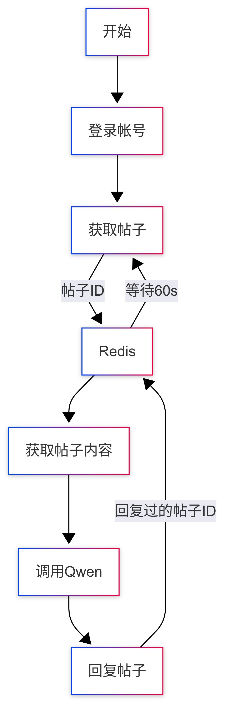

# Scm-Bot
## 介绍

这是一个用Rust编写的用于编程猫论坛的主动式Bot

## 工作逻辑



由于一些锁设计，有些流程可能阻塞进行...

## 部署过程

### 通过Docker部署

我建议你使用Docker部署，首先，创建`.env`文件

```env
RUST_LOG=TRACE
USERNAME=你的编程猫账号名
PASSWORD=你的编程猫密码
REDIS_URL=redis
LOOP_DELAY=60#每次获取帖子列表后等待的时间
REQUEST_PER_LOOP=10#每轮消费的回复数
OPENAI_API_KEY=sk-080bb #OPENAI 的APIKEY
OPEN_API_ENDPOINT=https://dashscope.aliyuncs.com/compatible-mode/v1 #OPENAI的后端URL,这里是阿里百炼
MODEL_NAME=qwen-flash #模型名
WAIT_TIME_PER_REQ=45 #每次回帖后等待的时间
```

然后你可以克隆仓库，使用Docker Compose自动部署

```bash
$ docker-compose up -d
```

### 手动编译

虽然麻烦，但不是为一种可行的办法，开发环境使用的Rust版本是Edition 2024,Rust版本至少为1.85.0

```bash
$ rustc --version
rustc 1.93.0 (254b59607 2026-01-19) (Arch Linux rust 1:1.93.0-1)
$ cargo build --release
$ redis-server --version
$ ./target/release/scm-bot
```

请确保环境变量已配置..

## 协议

该项目使用MIT License 开源，你拿这个软件做什么**本人均不负责任**
